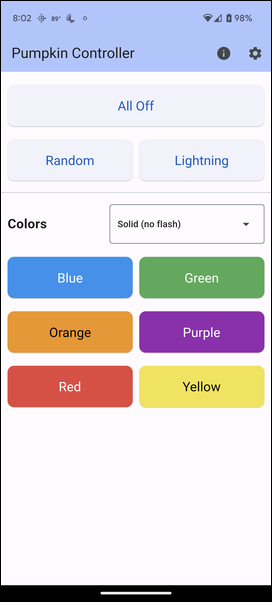

# Pumpkin Controller (Flutter)

The controller application for the [Glowing Pumpkin Xiao 5x5 BFF Server](https://github.com/johnwargo/glowing-pumpkin-xiao-bff-server). This is a full featured application written in Flutter that you can deploy to a mobile device (Android and iOS) or a web server. You can even run the application locally from Android Studio or Visual Studio Code (with the required Flutter SDK installed).

Use the application to:

* Start and stop the remote device displaying random colors
* Flash the remote device's LED matrix a random number of times white, like lightning flashes.
* Set a solid color
* Flash the LED matrix a solid color from 1 to 5 times.

Here's a screenshot of the application's home page on Android:

Here's a screenshot of the application's home page on iOS:

## Configuration

Before you can use the app to control a remote device, you must first configure the app with the IP Address of the remote device. To do this, tap the gear icon on the upper-right corner of the app's main screen (the previous image). When the settings page opens, you have a choice to makeregarding how the app connects to the remote device. The choice you make here depends on which code you have running on the device. 

* Select HTTP if the remote device runs [Glowing Pumpkin Xiao 5x5 BFF Server](https://github.com/johnwargo/glowing-pumpkin-xiao-bff-server).
* Select UDP it the remote device runs  [Glowing Pumpkin Xiao 5x5 BFF UDP](https://github.com/johnwargo/glowing-pumpkin-xiao-bff-udp).

For the HTTP configuration, enter the remote device's IP address in the input field as shown below, then tap the left arrow to return to the app's main screen. 

For UDP, change the prefix only if you changed the hostname in the sketch running on the device.

## Operation

Tap the **All Off** button to turn off the LED Matrix on the remote device.

Tap the **Random** button to instruct the remote device to display random colors for a random number of seconds before switching colors.

Tap the **Lightning** button to direct the remote device to flash the LEDs white a random number of times. At the conclusion, the remote device enables random mode.

To use colors, select a value from the dropdown list, then tap the appropriate color button for the color you want displayed on the remote device:

* Selecting **Solid (no flash)** sets all LEDs on the remote device to the selected color.
* Selecting any of the other options in the dropdown field flashes the selected color the number of times specified in the dropdown then enables random color mode on the device.

## Mobile App

I published the project here with full source code so developers familiar with Flutter development can deploy the application on their mobile phones. Reach out to let me know if you'd like me to publish the app to the App Stores (Apple and/or Google), and I'll try to make that happen.

***

You can find information on many different topics on my [personal blog](http://www.johnwargo.com). Learn about all of my publications at [John Wargo Books](http://www.johnwargobooks.com).

If you find this code useful and feel like thanking me for providing it, please consider <a href="https://www.buymeacoffee.com/johnwargo" target="_blank">Buying Me a Coffee</a>, or making a purchase from [my Amazon Wish List](https://amzn.com/w/1WI6AAUKPT5P9).